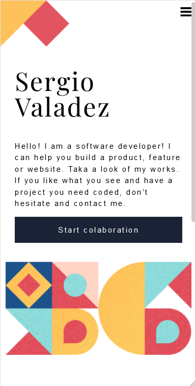

# My work portfolio

> This project is a personal portfolio of my work. On Information Technology. It will be bould using HTML, css, and javascript. It also wil have a framework that is still to be defined. It could be bootstrap or something similar. I Will be creating all the code of this project on VScode and the repository will be on GitHub.

Additional description about the project and its features.

## Built With

- Major languages: HTML, CSS, Javascript, GIT.
- Frameworks: Bootstrap
- Technologies used: mozilla, github, vscode, windows 10 and linux ubintu.

## Live Demo

Click here to see the [live demo](https://sergiogval.github.io).

## Getting Started

To get a local copy up and running follow these simple example steps.

### Prerequisites
A PC with a Windows 10 or Linux Ubuntu operating system. It has to have GIT installed.

### Setup
Go to the following site and clone the repository (https://github.com/sergiogval/sergiogval.github.io)
## Author

### Sergio Valadez

- GitHub: [@sergiogval](https://github.com/sergiogval/)
- Tweeter [@srgvldz](https://twitter.com/srgvldz)
- LinkedIn [@Sergio_Valadez](https://www.linkedin.com/in/sergio-valadez-282153216/)

## 🤝 Contributing

Contributions, issues, and feature requests are welcome!

Feel free to check the [issues page](../../issues/).

## Show your support

Give a ⭐️ if you like this project!

## Acknowledgments

- Hat tip to anyone whose code was used
- Inspiration
- etc

## 📝 License

This project is [MIT](./MIT.md) licensed.
